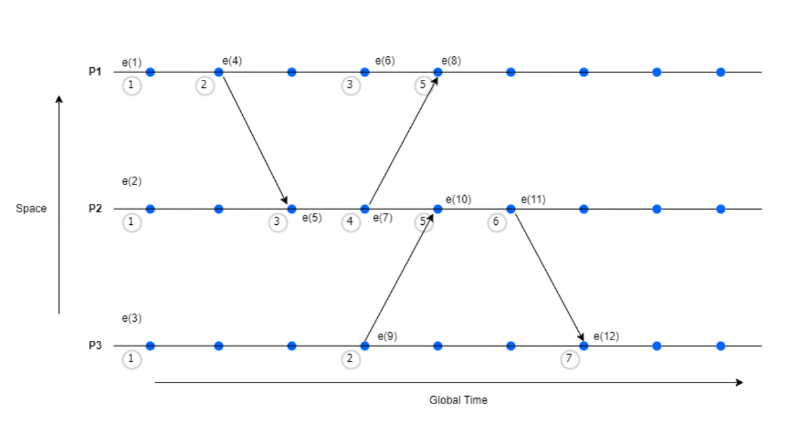
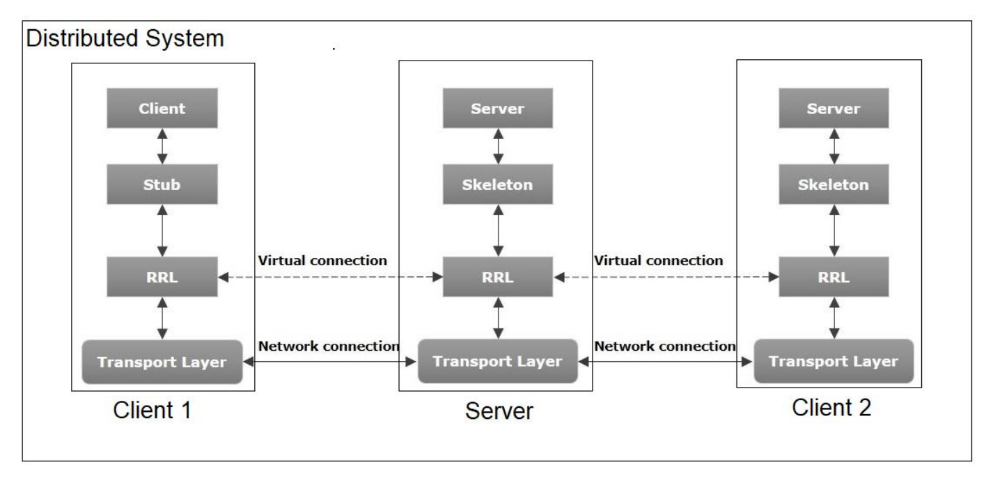
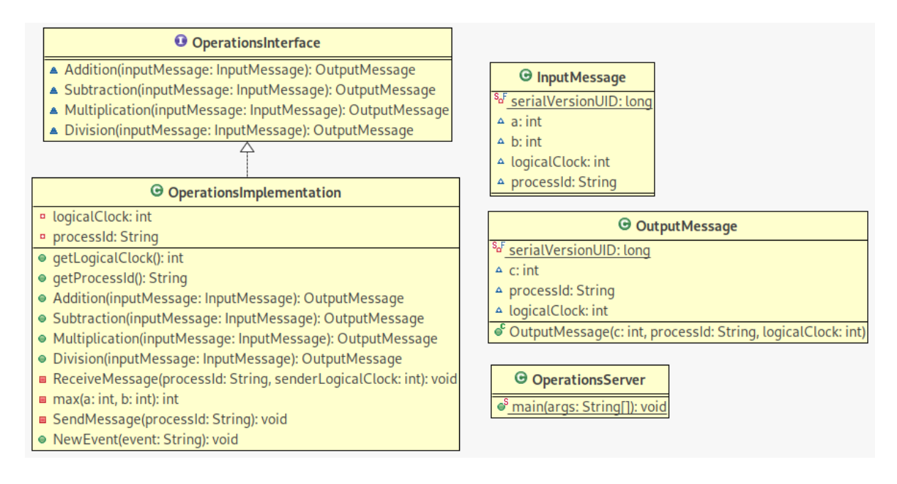
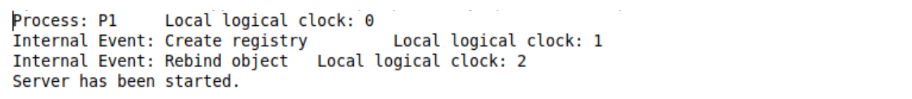
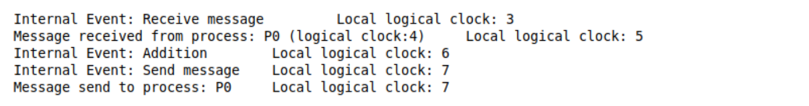
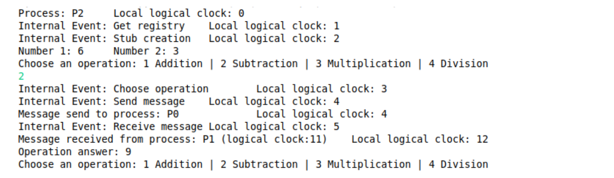
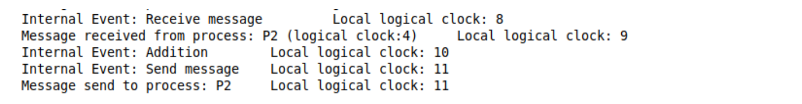

# Lamport Clock Algorithm Implementation using Java Remote Method Invocation (Java RMI)

## Introduction

The project focuses on the implementation of the Lamport clock algorithm, developed by Leslie Lamport, using Java Remote Method Invocation (Java RMI). Its objective is to determine the order of events occurring in a distributed system.

Distributed systems are composed of multiple independent computers that communicate and collaborate over a network to execute tasks. One of the challenges in distributed systems is maintaining clock synchronization among the different computers, as their clocks may drift over time due to hardware and software differences. This challenge is often referred to as the problem of clock synchronization.

One solution to this challenge is the concept of logical clocks, which capture the chronological order and causal relationships between systems in a distributed environment. Leslie Lamport introduced the Lamport timestamp algorithm in 1978, which utilizes logical clocks.

In this project, the Lamport clock algorithm was implemented using Java RMI, a Java API that enables programs to invoke methods on remote objects. Java RMI was chosen as the implementation language due to its capability to facilitate communication between distributed systems and its support for object-oriented programming.

The implemented system underwent thorough testing to ensure it accurately preserves the order of actions of multiple systems, and the performance of the system was evaluated. The results of the project demonstrate the effectiveness of the Lamport clock algorithm in preserving the order of events.


## Algorithm Description

The Lamport clock algorithm is a method for maintaining the order of events using their chronological order and causal relationships. The algorithm utilizes messages sent between computers to ensure that the logical clock values remain synchronized and performs partial ordering on events (not every pair of events needs to be compared). It is named after its creator, Leslie Lamport.

- **Happened-before relation**: `a → b`
  This relation is the central concept of logical clocks, signifying that event `a` happened before event `b`.

- **Logical Clock**: `(Ci/Cj is the logical clock time at any timestamp i/j)`
  - `[C1]`: `Ci(a) < Ci(b)` - If event `a` happened before event `b`, then the time of `a` will be less than the time of `b`.
  - `[C2]`: `Ci(a) < Cj(b)` - The clock value of `Ci(a)` is less than `Cj(b)`.

### Algorithm:

- Each computer in the distributed system maintains a logical clock value, initially set to zero.
- Whenever an event occurs on a computer, the logical clock value is incremented by one.
- When a message is sent from one computer to another, the sender includes its current logical clock value in the message.
- Upon receiving a message, a computer compares the logical clock value in the message to its own, taking the maximum of the local and received logical clock values, and increments it by 1.
- This process is repeated for each event and message in the system, ensuring that events maintain the order of occurrence.

### Pseudocode:

```java
// Sender side:
Logical_clock_Sen = 0; // Initialize local clock value to 0 (Sender).
When any event occurs:
  Logical_clock_Sen = Logical_clock_Sen + 1; // Increment local logical clock value by 1
When a message is sent from one computer to another:
  send(message, Logical_clock_Sen); // Include local clock value in the message

// Receiver Side:
Logical_clock_Rec = 0; // Initialize local clock value to 0 (Receiver).
When any event occurs:
  Logical_clock_Rec = Logical_clock_Rec + 1; // Increment local clock value by 1
When a computer receives a message:
  (message, Logical_clock_Sen) = receive();
  Logical_clock_Rec = max(Logical_clock_Rec, Logical_clock_Sen) + 1; // Update local logical clock value to the maximum of the local and received logical clock values and increment local clock value by 1
```

### Example



In the above diagram, there are 3 processes (P1, P2, and P3) having 12 events in total:

- In events e(1), e(2), and e(3), processes P1, P2, and P3 are initializing their logical clock time respectively to 0 and then 1.
- At e(4), P1 sent a message to P2 with its logical clock value and P2 received, compared for the maximum value, and incremented by 1. 
  - P1: Send(message, 2)
  - P2: Receive(message, 2) -> max(2, 2) + 1 = 3
- After processing the request, P2 sent the response back including its logical clock value to P1. At P1 side:
  - P2: Send(message, 4)
  - P1: Receive(message, 4) -> max(3, 4) + 1 = 5
- Similar steps were followed by communication between process P3 and P2 from event e(9) to e(12).

**Note**: In P1, e(6) is not interacting with any other process, and we cannot compare it with any other event as it will be concurrent. By just checking the timestamps, we could conclude that e(6) in P1 has happened before e(10) in P2, but this isn’t necessarily true.


## System Architecture




The system developed is based on a simple client-server architecture where both clients 1 and 2 communicate with the server for any of the four operations: addition, subtraction, multiplication, and division in a distributed system.


## Implementation

The implementation was developed using Java RMI. On the server side, mathematical operations were created to be consumed by the clients. Both the server and clients have their own logical clocks, internal events, and will send and receive messages. At all these events, the logical clock of each process (server or clients) will be calculated using the Lamport's clock algorithm.

### Server Diagram Class



In the server, the interface `OperationsInterface` defines the mathematical operations to be implemented.

```java
public interface OperationsInterface extends Remote
{
    OutputMessage Addition(InputMessage inputMessage) throws RemoteException;
    OutputMessage Subtraction(InputMessage inputMessage) throws RemoteException;
    OutputMessage Multiplication(InputMessage inputMessage) throws RemoteException;
    OutputMessage Division(InputMessage inputMessage) throws RemoteException;
}
```
The class `OperationsImplementations` not only implements the mathematical operations declared in the interface but also contains private methods and attributes that aid in implementing the algorithm. These include `ReceiveMessage`, `SendMessage`, `NewEvent`, `max`, `logicalClock`, and `processId`.

```java
private void SendMessage(String processId)
{
    NewEvent("Send message");    // send a message is an event
    System.out.println("Message send to process: " + processId + "\tLocal logical clock: " + this.logicalClock);
}
```

```java
private void ReceiveMessage(String processId, int senderLogicalClock)
{
    NewEvent("Receive message");    // receive a message is an event
    int maxLogicalClock = max(this.logicalClock, senderLogicalClock);
    this.logicalClock = maxLogicalClock + 1;
    System.out.println("Message received from process: " + processId + " (logical clock:" + senderLogicalClock
            + ")\tLocal logical clock: " + logicalClock);
}
```

```java
public void NewEvent(String event)
{
    this.logicalClock++;
    System.out.println("Internal Event: " + event + " \tLocal logical clock: " + logicalClock);
}
```

The objects of the classes `InputMessage` and `OutputMessage` represent the messages sent and received between the server and clients. In addition to the attributes needed for the mathematical operations, they also include the attributes `logicalClock` and `processId` required for the algorithm implementation.

The main method of the class `OperationsServer` creates the registry, rebinds the object with the implemented operations, and initializes the logical clock of the server to 0.

```java
public class OperationsServer
{
	public static void main(String args[])
	{
		// creating instance of implemented class
		OperationsImplementation operationsImplementation = new OperationsImplementation();
		System.out.println("Process: " + operationsImplementation.getProcessId() + "\tLocal logical clock: " +
				operationsImplementation.getLogicalClock());
		
		// important for the rmi registry location
		String ip = "127.0.0.1";
		System.setProperty("java.rmi.server.hostname", ip);
		
		Registry registry = null;
		
		try
		{
			int port = 10908;
			registry = LocateRegistry.createRegistry(port);
			operationsImplementation.NewEvent("Create registry");	// event create registry
		}
		catch (Exception ex)
		{
			System.out.println();
			System.out.println("Error: " + ex.toString());
		}
		
		try
		{
			OperationsInterface skeleton = (OperationsInterface)UnicastRemoteObject.exportObject(operationsImplementation, 0);
			
			registry.rebind("Operations", skeleton);
			operationsImplementation.NewEvent("Rebind object");	// event rebind
			
			System.out.println("Server has been started.");
		}
		catch (Exception ex)
		{
			System.out.println("Error: " + ex.toString());
		}
		
		return;
	}
}
```


## Client Diagram Class


In the client, the interface `OperationsInterface` contains the definition of the methods to be consumed from the server.

```java
public interface OperationsInterface extends Remote
{
	OutputMessage Addition(InputMessage inputMessage) throws RemoteException;
	OutputMessage Subtraction(InputMessage inputMessage) throws RemoteException;
	OutputMessage Multiplication(InputMessage inputMessage) throws RemoteException;
	OutputMessage Division(InputMessage inputMessage) throws RemoteException;
}
```

The classes `InputMessage` and `OutputMessage` serve the same function as described in the server side.

The class `OperationsClient` contains methods and attributes needed for the algorithm implementation, including `ReceiveMessage`, `SendMessage`, `NewEvent`, `max`, `logicalClock`, and `processId` (similar to the server). 

The main method of this class gets the registry, creates the stub, initializes the logical clock of the client to 0, and prompts the user for a mathematical operation.

```java
public class OperationsClient
{
	private static int logicalClock = 0;
	private static String processId = "P0";
	private static int a = 4;
	private static int b = 2;
	
	public static void main(String args[])
	{
		try
		{
			System.out.println("Process: " + processId + "\tLocal logical clock: " + logicalClock);
			
			String ip = "127.0.0.1";
			int port = 10908;
			Registry registry = LocateRegistry.getRegistry(ip, port);
			NewEvent("Get registry");		// event get registry
			
			OperationsInterface stub = (OperationsInterface)registry.lookup("Operations");
			NewEvent("Stub creation");		// event stub creation
			
			OutputMessage outputMessage = new OutputMessage();
			InputMessage inputMessage = new InputMessage(a, b, logicalClock, processId);
			
			System.out.println("Number 1: " + a + "\tNumber 2: " + b);
			
			while(true)
			{
				System.out.println("Choose an operation: 1 Addition | 2 Subtraction | 3 Multiplication | 4 Division");
				Scanner input = new Scanner(System.in);
				String msg = input.nextLine();
				//input.close();
				NewEvent("Choose operation");	// event ask for operation
				
				int operation = Integer.parseInt(msg);
				
				SendMessage();
				inputMessage.logicalClock = logicalClock;
				
				switch (operation)
				{
					case 1:
						outputMessage = stub.Addition(inputMessage);
						break;
					case 2:
						outputMessage = stub.Addition(inputMessage);
						break;
					case 3:
						outputMessage = stub.Addition(inputMessage);
						break;
					case 4:
						outputMessage = stub.Addition(inputMessage);
						break;
				}
				
				ReceiveMessage(outputMessage.processId, outputMessage.logicalClock);
				System.out.println("Operation answer: " + outputMessage.c);
			}
		}
		catch (Exception ex)
		{
			System.out.println("Err: " + ex.toString());
		}
	}
  // ...............


```


## Results

- Process P1: Server



- Process P0: Client 1
 

  
- Process P1: Server
 



- Process P2: Client 2
 



- Process P1: Server



Table with the outputs from 3 processes P0, P1 and P2.

| Event                      | Process 0 Logical Clock (Client 1) | Process 1 Logical Clock (Server) | Process 2 Logical Clock (Client 2) |
|----------------------------|-------------------------------------|----------------------------------|-----------------------------------|
| P0, P1, P2: Initialization| 0                                   | 0                                | 0                                 |
| P1: Create registry        | 0                                   | 1                                | 0                                 |
| P1: Rebind object          | 0                                   | 2                                | 0                                 |
| P0, P2: Get registry      | 1                                   | 2                                | 1                                 |
| P0, P2: Stub creation      | 2                                   | 2                                | 2                                 |
| P0: Choose operation       | 3                                   | 2                                | 2                                 |
| P0: Send message to P1     | 4                                   | 2                                | 2                                 |
| P1: Receive message from P0| 4                                   | 3                                | 2                                 |
| P1: Lamport Algorithm      | 4                                   | 5                                | 2                                 |
| P1: Process operation      | 4                                   | 6                                | 2                                 |
| P1: Send message to P0     | 4                                   | 7                                | 2                                 |
| P0: Receive message from P1| 5                                   | 7                                | 2                                 |
| P0: Lamport Algorithm      | 8                                   | 7                                | 2                                 |
| P2: Choose operation       | 8                                   | 7                                | 3                                 |
| P2: Send message to P1     | 8                                   | 7                                | 4                                 |
| P1: Receive message from P2| 8                                   | 8                                | 4                                 |
| P1: Lamport Algorithm      | 8                                   | 9                                | 4                                 |
| P1: Process operation      | 8                                   | 10                               | 4                                 |
| P1: Send message to P2     | 8                                   | 11                               | 4                                 |
| P2: Receive message from P1| 8                                   | 11                               | 5                                 |
| P2: Lamport Algorithm      | 8                                   | 11                               | 12                                |


## Conclusion

In this project, we implemented the Lamport clock algorithm using Java Remote Method Invocation (Java RMI) to determine the order of events in a distributed system. The Lamport clock algorithm proved to be effective in maintaining the chronological order and causal relationships between events in the system.

Through our implementation, we demonstrated the functionality of the algorithm by simulating communication between multiple processes, each with its own logical clock. By incorporating the Lamport clock algorithm into our system architecture, we ensured that events occurring across distributed processes were correctly ordered, despite potential delays and concurrency issues.

Our system architecture featured a client-server model, with clients communicating mathematical operations to the server using remote method invocation. Each process maintained its own logical clock, allowing for precise tracking of event ordering and facilitating the synchronization of distributed systems.

The results of our experiments clearly illustrate the successful implementation of the Lamport clock algorithm in preserving the order of events within a distributed environment. By meticulously tracking the logical clock values and event interactions, we verified the correctness and effectiveness of our system design.

Moving forward, our implementation provides a solid foundation for further exploration and optimization of distributed systems algorithms. Future work could involve scaling our system to handle larger numbers of processes, exploring alternative clock synchronization algorithms, or integrating additional features to enhance the robustness and efficiency of distributed applications.

Overall, this project underscores the importance of effective clock synchronization mechanisms in distributed systems and highlights the practical applications of the Lamport clock algorithm in ensuring reliable event ordering and consistency across distributed environments.


